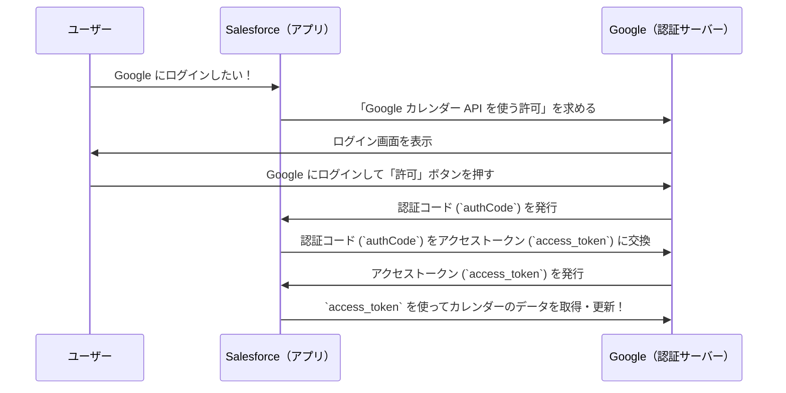

```mermaid
sequenceDiagram
    participant User as ユーザー
    participant Salesforce as Salesforce（アプリ）
    participant Google as Google（認証サーバー）

    User->>Salesforce: Google にログインしたい！
    Salesforce->>Google: 「Google カレンダー API を使う許可」を求める
    Google->>User: ログイン画面を表示
    User->>Google: Google にログインして「許可」ボタンを押す
    Google->>Salesforce: 認証コード (`authCode`) を発行
    Salesforce->>Google: 認証コード (`authCode`) をアクセストークン (`access_token`) に交換
    Google->>Salesforce: アクセストークン (`access_token`) を発行
    Salesforce->>Google: `access_token` を使ってカレンダーのデータを取得・更新！
```