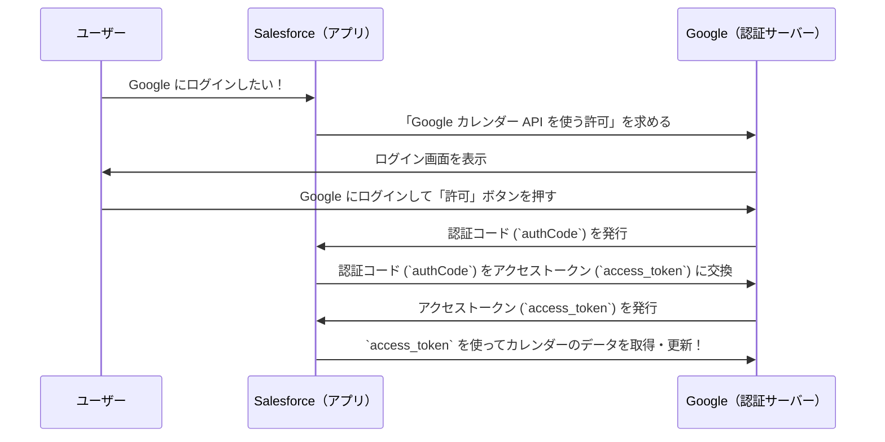
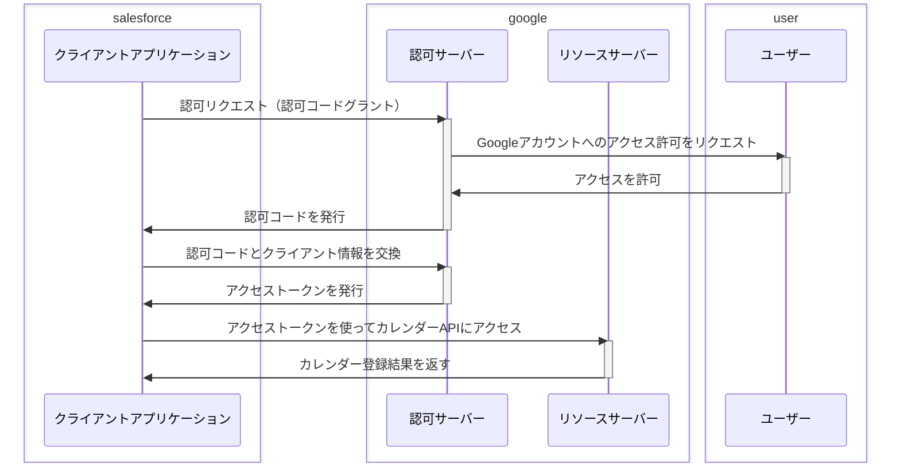
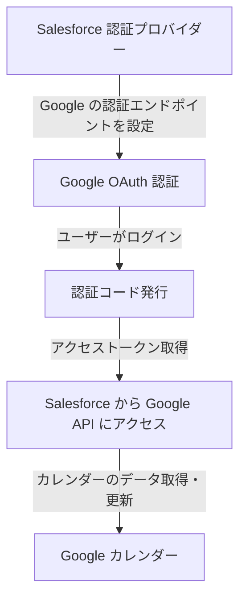

## OAuth2.0

図の説明

Salesforce（クライアントアプリケーション）が、Google（認可サーバー）に認可コードグラントをリクエストします。
Googleは、ユーザーにSalesforceがGoogleアカウントにアクセスすることを許可するかどうかを確認します。
ユーザーが許可すると、GoogleはSalesforceに認可コードを発行します。
Salesforceは、認可コードとクライアント情報（クライアントID、クライアントシークレットなど）をGoogleに渡して、アクセストークンを要求します。
Googleは、アクセストークンをSalesforceに発行します。
Salesforceは、アクセストークンを使ってGoogle Calendar API（リソースサーバー）にアクセスし、カレンダー登録を行います。
Google Calendar APIは、カレンダー登録結果をSalesforceに返します。
補足

認可コードグラントは、Webアプリケーションなどでよく使われる、最も一般的なOAuth 2.0のグラントタイプです。
アクセストークンは、クライアントアプリケーションがユーザーの代わりにリソースサーバーにアクセスするための鍵のようなものです。
アクセストークンには有効期限があり、期限が切れたら再発行する必要があります。
Web Senpaiからのアドバイス

OAuth 2.0の認可コードグラントは、セキュリティと利便性を両立させるための優れた仕組みです。SalesforceとGoogle Calendar APIを連携させる際には、ぜひOAuth 2.0を活用してください。

何か質問があれば、遠慮なく聞いてくださいね

## SF認証プロバイダーのフロー
